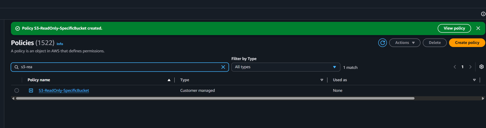
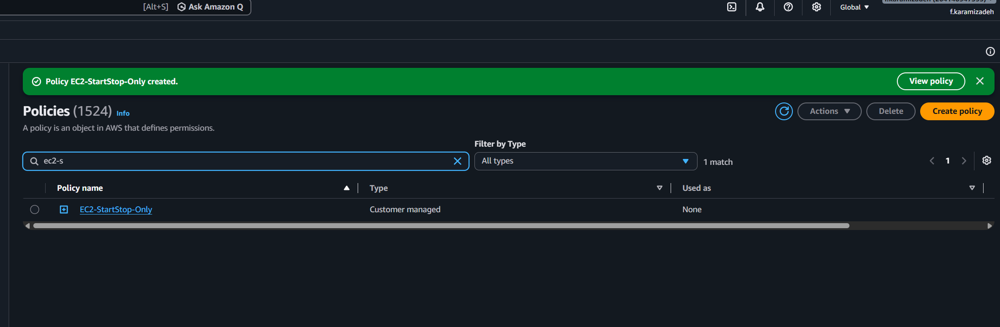
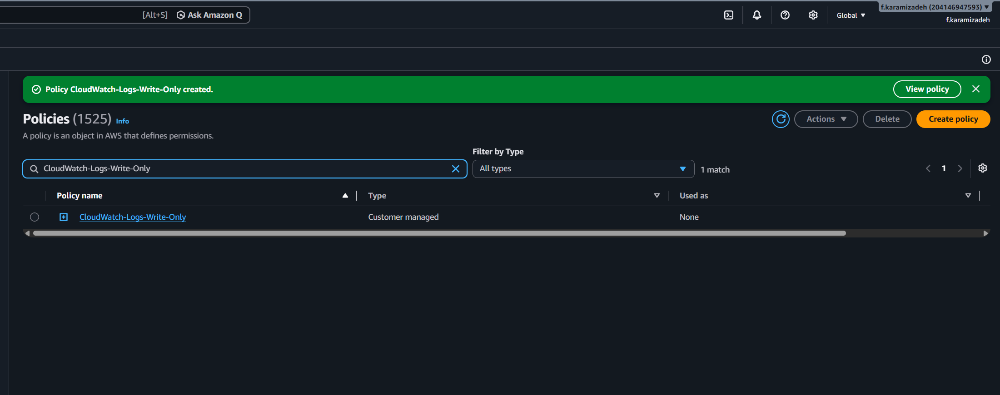
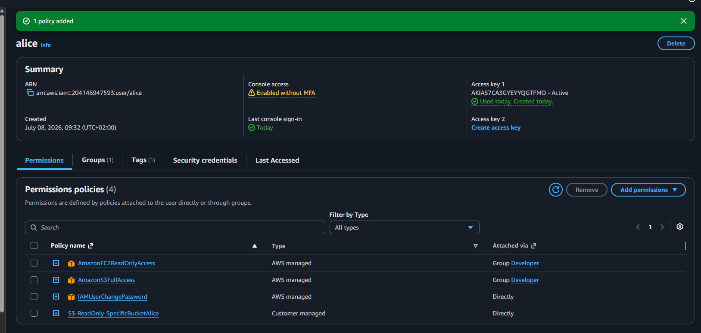
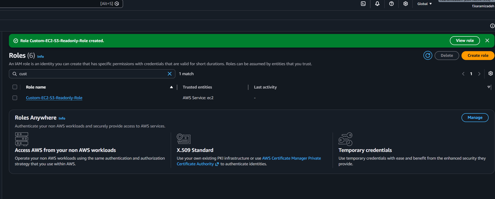
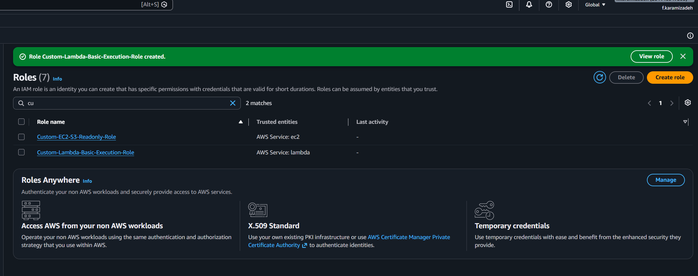
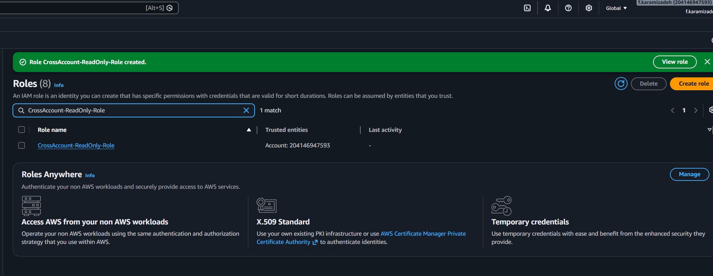
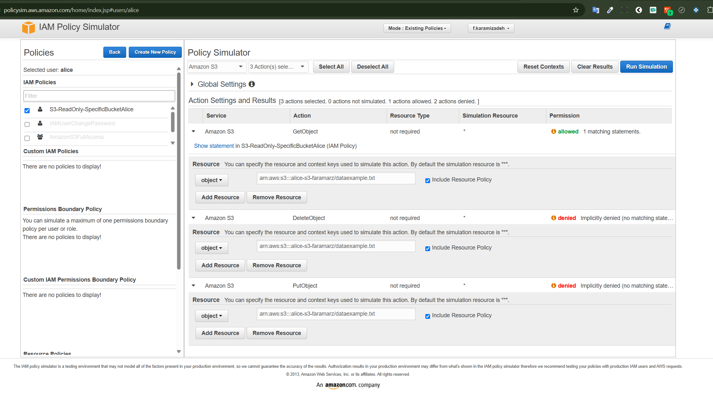
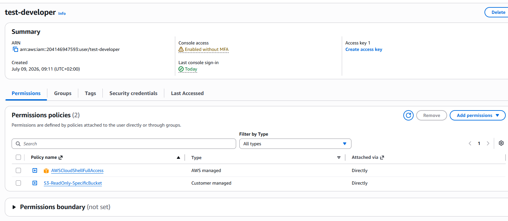

# Lab Solution: IAM Policies and Roles

**Student Name:** Faramarz Karamizadeh  
**Date:** 08.07.2026  
**Lab Completion Time:** ___________ minutes

---

## Part 1: Understanding IAM Policy Structure

### Task 1: Policy Components Explanation

**Explain each component in your own words:**

**Version:**
```
We always use 2012-10-17. It is the latest version that AWS uses.
```

**Statement:**
```
It is the main building block of a policy. I use it as a container to group all the rules (Effect, Action, Resource) for a specific permission setup.
```

**Sid:**
```
It is an optional, custom label I give to a statement. It acts like a comment or a name tag to help me quickly identify what this specific block does.
```

**Effect:**
```
This defines the outcome of the rule. I set it to either "Allow" or "Deny" to explicitly permit or block the specified actions.
```

**Action:**
```
This is the specific API call or operation I want to target. It tells AWS exactly what the identity is trying to do, like "s3:GetObject" or "ec2:StartInstances".
```

**Resource:**
```
This defines the exact object or asset that the actions apply to. I specify it using an ARN (Amazon Resource Name) to ensure the permissions are locked down to a precise target.
```

---

## Part 2: Custom IAM Policies Created

### S3 Read-Only Policy

**Policy Name:** S3-ReadOnly-SpecificBucket

**Bucket Name Used:** s3-demo-free

**Policy JSON:**
```json
{
  "Version": "2012-10-17",
  "Statement": [
    
    
    
  ]
}
```

**Screenshot 1: S3 Custom Policy**


---

### EC2 Start/Stop Policy

**Policy Name:** EC2-StartStop-Only

**Policy ARN:**  *

**Screenshot 2: EC2 Custom Policy**


---

### CloudWatch Logs Write Policy

**Policy Name:** CloudWatch-Logs-Write-Only

**Policy ARN:** arn:aws:logs:*:*:log-group:/aws/*

**Screenshot 3: CloudWatch Logs Policy**


---

## Part 3: Policy Attachments

### Policy Attached to User

**User Name:** alice

**Policy Attached:** S3-ReadOnly-SpecificBucketAlice

**Attachment Method:** x Console ☐ CLI

**CLI Command (if used):**
```bash
_____________________________________________________________
_____________________________________________________________
```

**Screenshot 4: Policy Attached**


---

## Part 4: IAM Roles Created

### EC2 Service Role

**Role Name:** Custom-EC2-S3-ReadOnly-Role

**Role ARN:** arn:aws:iam::204146947593:instance-profile/Custom-EC2-S3-Readonly-Role
**Trusted Entity:** AWS Service: ec2.amazonaws.com
**Attached Policies:**
1. EC2-S3-ReadOnly-Role
2. ___________________________

**Trust Relationship JSON:**
```json
{
  "Version": "2012-10-17",
  "Statement": [
     {
            "Effect": "Allow",
            "Principal": {
                "Service": "ec2.amazonaws.com"
            },
            "Action": "sts:AssumeRole"
        }
    
  ]
}
```

**Screenshot 5: EC2 Service Role**


---

### Lambda Execution Role

**Role Name:** Custom-Lambda-Basic-Execution-Role

**Role ARN:** arn:aws:iam::204146947593:role/Custom-Lambda-Basic-Execution-Role

**Attached Policies:**
1. AWSLambdaBasicExecutionRole
2. CloudWatch-Logs-Write-Only

**Screenshot 6: Lambda Role**


---

### Cross-Account Access Role

**Role Name:** CrossAccount-ReadOnly-Role

**Role ARN:** arn:aws:iam::204146947593:role/CrossAccount-ReadOnly-Role

**External Account ID:** 204146947593

**External ID:** unique-external-id-123

**Attached Policies:**
1. ReadOnlyAccess
**Screenshot 7: Cross-Account Role**


---

## Part 5: Policy Testing

### Policy Simulator Results

**Policy Tested:** S3-ReadOnly-SpecificBucket
**Test Results:**

| Action | Expected Result | Actual Result | Pass/Fail |
|--------|----------------|---------------|-----------|
| s3:GetObject | Allowed | | ❎ Pass ☐ Fail |
| s3:PutObject | Denied | | ❎ Pass ☐ Fail |
| s3:DeleteObject | Denied | | ❎ Pass ☐ Fail |
| ec2:StartInstances | | | ☐ Pass ❌ Fail |
| ec2:TerminateInstances | | | ☐ Pass ❌ Fail |

**Screenshot 8: Policy Simulator**


---

### AWS CLI Testing

**Test 1: S3 List Bucket**
```bash
# Command:
 aws s3 ls s3://s3-demo-free  

# Output:
2026-07-08 09:59:37         12 dataexample.txt
_____________________________________________________________
_____________________________________________________________

# Result: ❎ Success ☐ Access Denied
```

**Test 2: S3 Upload File**
```bash
# Command:
aws s3 cp test.txt s3://s3-demo-free
# Output:
upload failed: ./test.txt to s3://s3-demo-free/test.txt An error occurred (AccessDenied) when calling the PutObject operation: User: arn:aws:iam::204146947593:user/test-developer is not authorized to perform: s3:PutObject on resource: "arn:aws:s3:::s3-demo-free/test.txt" because no identity-based policy allows the s3:PutObject action
_____________________________________________________________
_____________________________________________________________

# Result: ☐ Success ❌ Access Denied (Expected)
```

**Test 3: S3 Download File**
```bash
# Command:
aws s3 cp s3://s3-demo-free/dataexample.txt ./
# Output:
download: s3://s3-demo-free/dataexample.txt to ./dataexample.txt 
_____________________________________________________________
_____________________________________________________________

# Result: ❎ Success ☐ Access Denied
```

---

## Part 6: Least Privilege Implementation

### Custom Policy with Conditions

**Policy Name:** 
S3-TimeLimit-8-12AM

**Condition Type Used:** ☐ IP Address ❎ Time Window ☐ MFA ☐ Other: _______

**Policy JSON:**
```json
{
    "Version": "2012-10-17",
    "Statement": [
        {
            "Effect": "Allow",
            "Action": [
                "s3:*"
            ],
            "Resource": "*",
            "Condition": {
                "DateGreaterThan": {
                    "aws:CurrentTime": "2026-01-14T08:00:00Z"
                },
                "DateLessThan": {
                    "aws:CurrentTime": "2026-12-15T12:00:00Z"
                }
            }
        }
    ]
}
```

**Rationale for this policy:**
```
	
Limit s3 access from 8- 12 AM every day until 2026-12-15

```

---

## Part 7: Troubleshooting

### Issue Encountered (if any)

**Issue Description:**
```
test-developer has no right to Cloudshell
```

**Commands Used to Diagnose:**
```bash

```

**Resolution:**
```
i grant AWSCloudShellFullAccess policy to the user
_____________________________________________________________
_____________________________________________________________
```

**Screenshot 9: Troubleshooting Output**


---

## Reflection Questions

### 1. Why are IAM roles preferred over access keys for EC2 instances?

**Your answer:**
```
IAM roles are preferred because they provide temporary, automatically rotated credentials instead of hardcoded long-term secrets, which eliminates the risk of access keys being leaked, stolen, or compromised on the EC2 instance.
_____________________________________________________________
```

### 2. Explain the principle of least privilege and how you applied it in this lab.

**Your answer:**
```
S3 Bucket readonly access for developers.
_____________________________________________________________
```

### 3. What is the difference between identity-based and resource-based policies?

**Your answer:**
```
Identity-based policies are attached to IAM users, groups, or roles to define what actions that identity can perform on any resource.

Resource-based policies are attached directly to a resource (like an S3 bucket ) and define who (which principals) can access that specific resource and what actions they can take.
_____________________________________________________________
```

### 4. When would you use an explicit "Deny" in a policy?

**Your answer:**
```
An explicit "Deny" is used to override any "Allow" permissions and strictly block specific actions. It is commonly used for setting up organizational guardrails (like preventing the deletion of logs), making exceptions to broad permissions, or blocking access if security conditions—like using MFA or a specific corporate IP—are not met.
_____________________________________________________________
```

### 5. Describe a scenario where you'd use conditions in IAM policies.

**Your answer:**
```
I would use IAM conditions to restrict access to AWS resources based on dynamic variables, such as forcing an engineer to be connected to the company's Germany office IP address or requiring Multi-Factor Authentication (MFA) before allowing critical infrastructure modifications.
_____________________________________________________________
```

---

## Summary of Resources Created

**IAM Policies:**
1. S3-ReadOnly-SpecificBucket (ARN: arn:aws:iam::204146947593:policy/S3-ReadOnly-SpecificBucket)
2. EC2-StartStop-Only  (ARN: arn:aws:iam::204146947593:policy/EC2-StartStop-Only)
3. DevBucketAccessPolicy  (ARN: arn:aws:iam::204146947593:policy/DevBucketAccessPolicy)

**IAM Roles:**
1. Custom-EC2-S3-Readonly-Role  (ARN: arn:aws:iam::204146947593:role/Custom-EC2-S3-Readonly-Role)
2. CrossAccount-ReadOnly-Role  (ARN: arn:aws:iam::204146947593:role/CrossAccount-ReadOnly-Role)
3. Custom-Lambda-Basic-Execution-Role (ARN: arn:aws:iam::204146947593:role/Custom-Lambda-Basic-Execution-Role)

**Users Modified:**
1. test-developer

---

## Cleanup Confirmation

- [❎ ] Detached all custom policies from users
- [❎ ] Deleted custom IAM policies
- [❎ ] Detached policies from roles
- [❎ ] Deleted test IAM roles
- [ ] Verified no resources remain

**Cleanup Commands:**
```bash
_____________________________________________________________
_____________________________________________________________
_____________________________________________________________
_____________________________________________________________
```

---

## Self-Assessment

**Rate your understanding (1-5):**

| Concept | Before Lab | After Lab | Improvement |
|---------|-----------|-----------|-------------|
| IAM Policy Structure | ___/5 | ___/5 | +___ |
| Custom Policy Creation | ___/5 | ___/5 | +___ |
| IAM Roles | ___/5 | ___/5 | +___ |
| Service Roles | ___/5 | ___/5 | +___ |
| Trust Relationships | ___/5 | ___/5 | +___ |
| Policy Testing | ___/5 | ___/5 | +___ |
| Least Privilege | ___/5 | ___/5 | +___ |
| Troubleshooting IAM | ___/5 | ___/5 | +___ |

---

## Instructor Verification

**Instructor Name:** ___________________________

**Date Reviewed:** ___________________________

**All policies validated:** ☐ Yes ☐ No

**Roles properly configured:** ☐ Yes ☐ No

**Comments:**
```
_____________________________________________________________
_____________________________________________________________
_____________________________________________________________
```

**Grade/Status:** ___________________________

---

**Lab Status:** ☐ Complete ☐ Needs Revision

**Submission Date:** ___________________________
